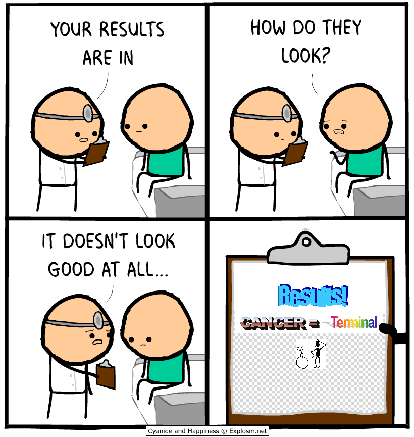

# JiuPresence



Facial recognition attendance system for Brazilian Jiu-Jitsu academies. Replaces manual attendance sheets with on-device face detection and biometric matching. Built with Flutter, Supabase, and on-device ML.

## Why

Manual attendance tracking in martial arts academies is slow and error-prone. Professors spend 5-10 minutes per class calling names or passing paper sheets. JiuPresence lets them take a single group photo, detects every face, matches against the student database, and marks attendance for the entire class in seconds.

LGPD (Brazilian federal privacy law) requires explicit consent for biometric data processing. Most academies lack proper documentation. JiuPresence handles the consent flow digitally at registration.

## Key Features

- **On-device face detection** - Google ML Kit detects faces in group photos. All processing stays on the device, no cloud ML involved.
- **FaceNet-style embedding matching** - tflite_flutter extracts 128D face embeddings and matches them via cosine similarity against the database.
- **Manual override** - If confidence is below threshold, the professor selects the student manually. Target accuracy is 85-90%.
- **LGPD digital consent** - Students sign the consent term on the device during registration. Separate guardian consent for minors.
- **PDF attendance reports** - Daily, weekly, monthly, annual reports via Syncfusion PDF.
- **Push notifications** - Firebase Cloud Messaging sends alerts when a student reaches attendance milestones for belt promotion.
- **Supabase backend** - PostgreSQL with pgvector extension for storing and querying face embeddings. Auth, storage, and realtime built-in.
- **Manual license activation** - Web dashboard for academy license management. No automatic payments.
- **Portuguese interface** - All UI text in Portuguese, designed for non-technical professors.

## Architecture

Single Flutter codebase targeting Android, iOS, and web (web for dashboards/reports only).

```
Flutter App
├── UI Layer (Screens)
│   ├── LoginScreen         Email/password auth
│   ├── RegistrationScreen  Student registration + LGPD consent
│   ├── HomeScreen          Dashboard, attendance, reports
│   └── FaceCaptureScreen   Camera + face detection + embedding
├── Service Layer
│   └── SupabaseService     Singleton wrapping Supabase client
└── ML Layer
    └── FaceNetService      Google ML Kit + tflite_flutter
```

## Tech Stack

| Layer | Technology |
|-------|-----------|
| Frontend | Flutter 3.2+, Dart |
| Face Detection | google_mlkit_face_detection |
| Face Embeddings | tflite_flutter (FaceNet model) |
| Backend | Supabase (PostgreSQL + pgvector + Auth + Storage) |
| Push Notifications | Firebase Cloud Messaging |
| PDF Reports | Syncfusion Flutter PDF |
| Validation | image_picker, camera, cpf_cnpj_validator |

## Getting Started

### Prerequisites

- Flutter SDK >=3.2.0
- Supabase project with the schema from `supabase/schema.sql`
- Firebase project for Cloud Messaging
- FaceNet .tflite model file (not included in this repo)

### Setup

```bash
git clone https://github.com/francojeferson/jiu_presence.git
cd jiu_presence
flutter pub get
```

Configure Supabase credentials in `lib/services/supabase_service.dart`.

Run on device:

```bash
flutter run
```

Run tests:

```bash
flutter test
```

### Supabase Schema

The schema in `supabase/schema.sql` includes:

- `academia` table - Academy registration with license expiration
- `aluno` table - Student data with embedding vector(128) and LGPD consent fields
- `presenca` table - Attendance records

The `pgvector` extension enables cosine similarity queries for face matching directly in the database.

## Current Status

MVP in early development. Core screens are implemented with mocked ML processing. The face detection pipeline uses real Google ML Kit detection but returns mock embeddings until the FaceNet .tflite model is added to assets.

See `.memory-bank/` for detailed project documentation.

## License

See LICENSE file (not yet defined).
